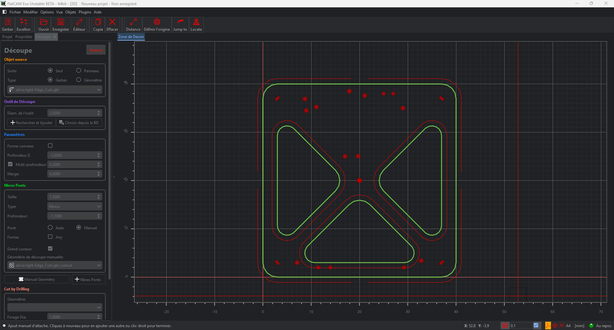
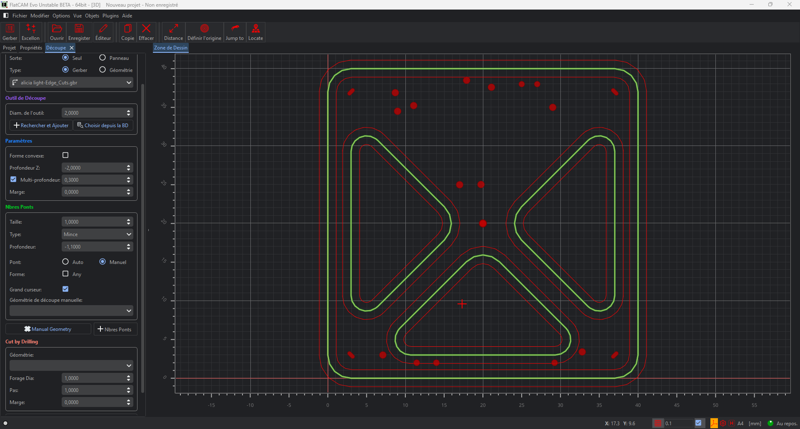
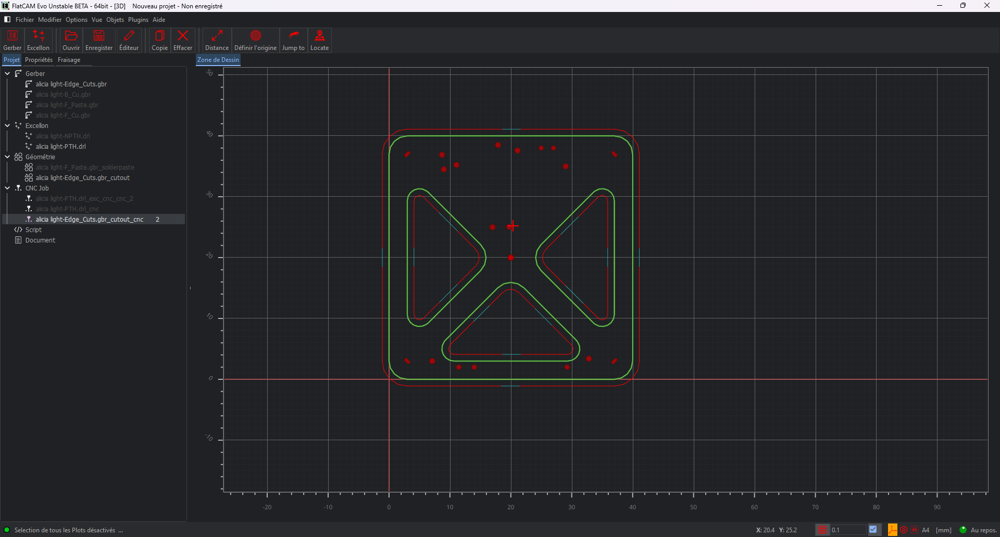

# FlatCAM Fixed Vibe Coded fork

This repository is a personal fork of FlatCAM / FlatCAM Evo with practical PCB
milling fixes. See [FORK_NOTES.md](FORK_NOTES.md) for the fork notes, upstream
attribution, license reminder, and the current list of changes.

## What this fork fixes

This fork currently focuses on practical CNC/PCB workflow fixes tested on real
KiCad and FlatCAM jobs.

### KiCad Edge.Cuts internal cutouts

FlatCAM's Cutout tool could generate the toolpath on the wrong side of internal
openings when the outside board profile and inner cutouts came from the same
KiCad `Edge.Cuts` Gerber. In the example below, the triangular internal cutouts
were not handled as expected.



The fix changes the contour selection logic so the largest contour is treated as
the outside board profile, while smaller closed contours are treated as internal
openings.

During development, one intermediate version recovered the inner contours but
cut both sides of the same shapes. This regression is documented too, so the
change history stays visible and reproducible.



Final result: the internal triangular openings are cut on the correct side,
while the outside board contour keeps the outside cut.



More dated screenshots and notes are tracked in
[`docs/CHANGELOG_VISUAL.md`](docs/CHANGELOG_VISUAL.md).

## Windows quick setup

For normal users, download and run:

[`FlatCAM-Fixed-Setup.exe`](https://github.com/JoLaFripouille/flatcam-fixed-vibe-coded/releases/download/v0.1.1/FlatCAM-Fixed-Setup.exe)

It installs FlatCAM Fixed with its own portable Python runtime, so users should
not need to install Python or run PowerShell commands.

Developers can build the installer from the repository with:

```powershell
powershell -ExecutionPolicy Bypass -File .\BUILD_SETUP_EXE.ps1
```

The installer source is in [`installer/FlatCAM-Fixed.iss`](installer/FlatCAM-Fixed.iss).

For a source-tree install without building an `.exe`, run:

```powershell
powershell -ExecutionPolicy Bypass -File .\SETUP_WINDOWS.ps1 -CreateDesktopShortcut
```

The easy setup file is at the repository root:
[`SETUP_WINDOWS.ps1`](SETUP_WINDOWS.ps1)

More details: [`scripts/windows`](scripts/windows/README.md).

---

FlatCAM Evo (c) 2019 - by Marius Stanciu

Based on FlatCAM: 
2D Computer-Aided PCB Manufacturing by (c) 2014-2018 Juan Pablo Caram
=====================================================================

FlatCAM is a program for preparing CNC jobs for making PCBs on a CNC router.
Among other things, it can take a Gerber file generated by your favorite PCB
CAD program, and create G-Code for Isolation routing.

=====================================================================

-------------------------- Installation instructions ----------------

Works with Python version 3.6 or greater and PyQt6.
More on the YouTube channel: 
https://www.youtube.com/playlist?list=PLVvP2SYRpx-AQgNlfoxw93tXUXon7G94_

You can contact me on my email address found in the app in:
Menu -> Help -> About FlatCAM -> Programmers -> Marius Stanciu

- Make sure that your OS is up-to-date
- Download sources from: https://bitbucket.org/jpcgt/flatcam/downloads/
- Unzip them on an HDD location that your user has permissions for.

**************************************************************************
1.Windows
**************************************************************************
- download the provided installer (for your OS flavor 64bit or 32bit) from:
https://bitbucket.org/jpcgt/flatcam/downloads/
- execute the installer and install the program. It is recommended to install as a Local User.

or from sources:
- download the sources from the same location
- unzip them on a safe location on your HDD that your user has permissions for
- install WinPython e.g. WinPython 3.9 downloaded from here: 
https://sourceforge.net/projects/winpython/files/WinPython_3.9/
Use one of the versions (64bit or 32it) that are compatible with your OS. 
To save space use one of the versions that have the smaller size (they offer 2 versions: 
one with size of few hundred MB and one smaller with size of few tens of MB)

- add Python folder and Python\Scripts folder to your Windows Path 
- (https://docs.microsoft.com/en-us/previous-versions/office/developer/sharepoint-2010/ee537574(v%3Doffice.14))
- verify that the pip package can be run by opening Command Prompt(Admin) and running the command:
```
pip -V
```

- look in the requirements.txt file (found in the sources folder) and install all the dependencies using 
the pip package. 
The required wheels can be downloaded either from:
https://www.lfd.uci.edu/~gohlke/pythonlibs/ (Recommended)
or if the required modules cannot be found in the previous source use:
https://pypi.org/
 
You can download all the required wheels files into a folder (e.g D:\my_folder) and install them from 
Command Prompt like this:

```
cd D:\my_folder
```

and for each wheel file (*.whl) run:
```
D:\my_folder\> pip install --upgrade package_from_requirements.whl
```

Run FlatCAM beta from the installation folder (e.g D:\FlatCAM_beta) in the Command Prompt with the following command:
cd D:\FlatCAM_beta
python FlatCAM.py

**************************************************************************
2.Linux
**************************************************************************
- create a folder to hold the sources somewhere on your HDD:
mkdir FlatCAM-beta

- unzip in this folder the sources downloaded from https://bitbucket.org/jpcgt/flatcam/downloads/
Using commands (e.g using the sources for FlatCAM beta 8.995):
cd ~/FlatCAM-beta
wget https://bitbucket.org/jpcgt/flatcam/downloads/FlatCAM_beta_8.995_sources.zip
unzip FlatCAM_beta_8.995_sources.zip
cd FlatCAM_beta_8.995_sources

- make sure that Python 3.9 is installed on your OS and that the command: python3 -V confirm it
- verify that the pip package is installed for your Python installation (e.g 3.9) by running the command:
```
pip3 -V
``` 

If it is not installed, install it. In Ubuntu-like OS's it is done like this: 
```
sudo apt-get install python3-pip 
```
or:
```
sudo apt-get install python3.9-pip
```
- verify that the file setup_ubuntu.sh has Linux line-endings (LF) and that it is executable (chmod +x setup_ubuntu.sh)
- run the file setup_ubuntu.sh and install all the dependencies with the command:
```
./setup_ubuntu.sh
```
- if the previous command is successful and has no errors, run FlatCAM with the command: python3 FlatCAM.py

- Alternatively you can install it on Ubuntu with:
```
# Optional if depencencies are missing
make install_dependencies

# Install for the current user only (using the folder in its place)
make install

# System-wide instalation
sudo make install
```

3.MacOS

Instructions from here: https://gist.github.com/natevw/3e6fc929aff358b38c0a#gistcomment-3111878

- create a folder to hold the sources somewhere on your HDD:
mkdir FlatCAM-beta

- unzip in this folder the sources downloaded from https://bitbucket.org/jpcgt/flatcam/downloads/
Using commands (e.g using the sources for FlatCAM beta 8.995):
cd ~/FlatCAM-beta
wget https://bitbucket.org/jpcgt/flatcam/downloads/FlatCAM_beta_8.995_sources.zip
unzip FlatCAM_beta_8.995_sources.zip
cd FlatCAM_beta_8.995_sources

- check if Homebrew is installed:
xcode-select --install
ruby -e "$(curl -fsSL https://raw.githubusercontent.com/Homebrew/install/master/install)"

- install dependencies:
brew install pyqt
brew install gdal
python3 -m ensurepip
python3 -m pip install -r requirements.txt

- run FlatCAM
python3 FlatCAM.py
